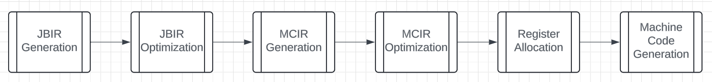

# Just a Backend (jb)

Optimizing compiler backend.

Currently uses with a two-tiered graph-based static single assignment intermediate representation.

WIP

misc. (unfinished and most likely outdated)stuff

register allocator based loosely on
https://dl.acm.org/doi/10.1145/330249.330250
